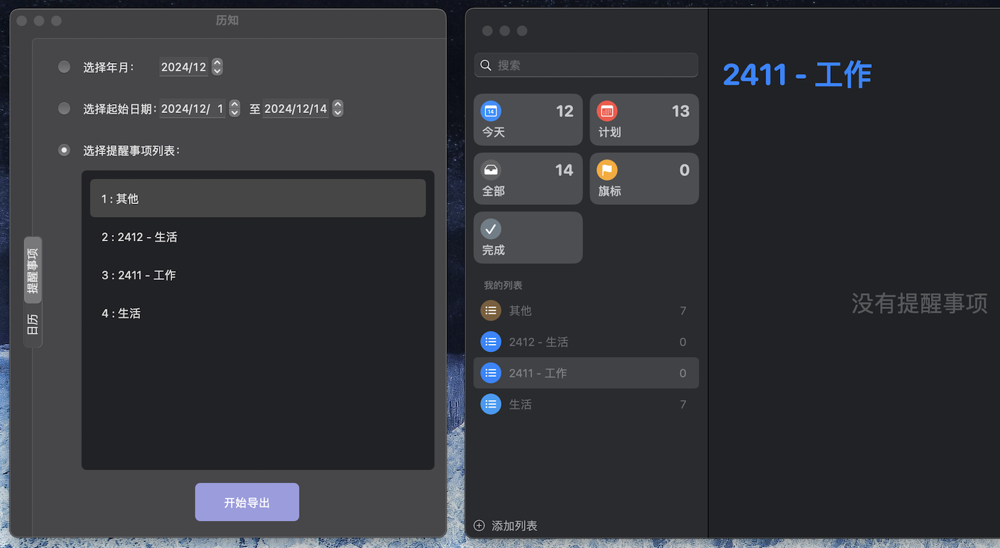
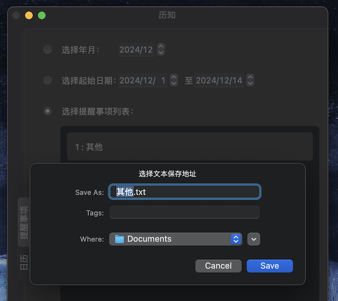
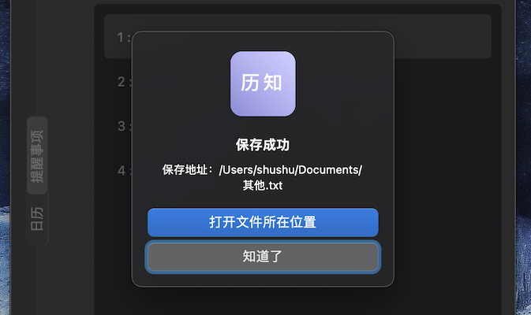
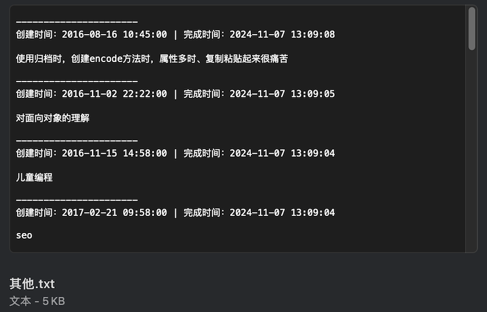

# 历知
历知是一个  macOS 日历/提醒事项 导出工具。 

使用 iOS/macOS 原生的 日历/提醒事项，可以便捷免费的管理日程和计划；

本工具可以导出备份数据，希望对你有帮助！

欢迎贡献代码 💐

***

## 功能说明

可以按照 年月、起始日期、列表项，来导出 提醒事项

    

***

选择导出地址

    

***

打开导出文件所在地址 

    

***

导出数据

    

***

### 授权说明

开启时，会提示需要 日历/提醒事项 访问权限；有着权限才能拿到数据。

开发状态下，如果没有签名，可能每次都会被申请授权。签名后会记录授权状态。

    
 

***
